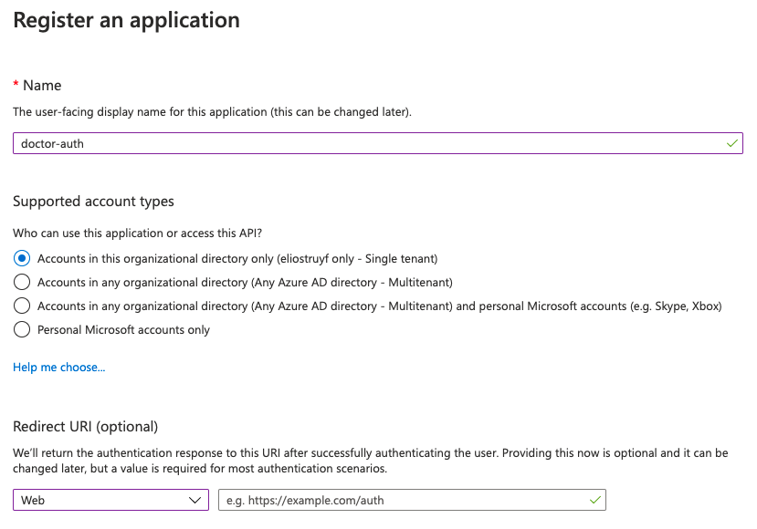

If you want to use certificate authentication, you will need to follow the next steps before you can use `doctor`.

- Go to your [Azure Portal](https://portal.azure.com)
- Open your **Azure Active Directory**
- Click on **App registrations**
- Click on **New registration**
- Specify a name for your new Azure AD app

- Once the app is created, click on **API Permissions** and add the **Sites.FullControl.All** application permission scope from SharePoint 

- Click on **Grant admin consent for <tenant>**, and accept
- Open a command prompt, and run the following command in order to generate a certificate: `openssl req -x509 -newkey rsa:4096 -keyout key.pem -out cert.pem -days 366 -nodes`

- Upload the **cert.pem** file to the Azure AD App under **Certificates & secrets**

- Converted the certificate into the `PKCS` format using `openssl pkcs12 -export -out cert.pfx -inkey key.pem -in cert.pem`
  - It will ask for a password. This is yours to pick. Be aware, if you specify a password, you will also need to pass it to the `doctor` command with the `--password <password>` argument.

- Get the `base64` string from the `pfx` file. Execute: `cat cert.pfx | base64`
  - Use the `Base64` output as the input for the `--certificateBase64Encoded <certificateBase64Encoded>` argument.

Once you did the previous steps, you are ready to make use of the `doctor` tool. You can run `doctor` with the certificate authentication as follows: `doctor publish --auth certificate --certificateBase64Encoded <certificateBase64Encoded> --appId <appId> --tenant <tenant> --url <url>`.

> **Info**: You can also store these `certificateBase64Encoded`, `appId`, and `tenant` settings in the `doctor.json` file. More information can be found under the [doctor.json](../options/#doctorjson) section.